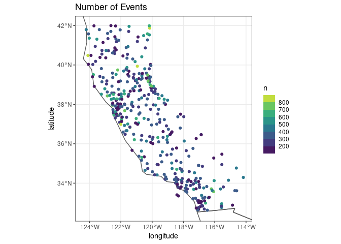
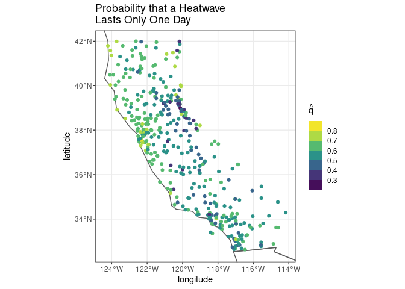
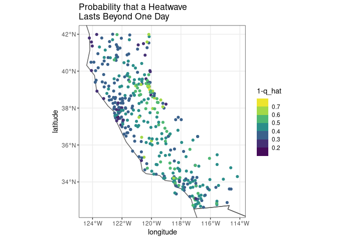
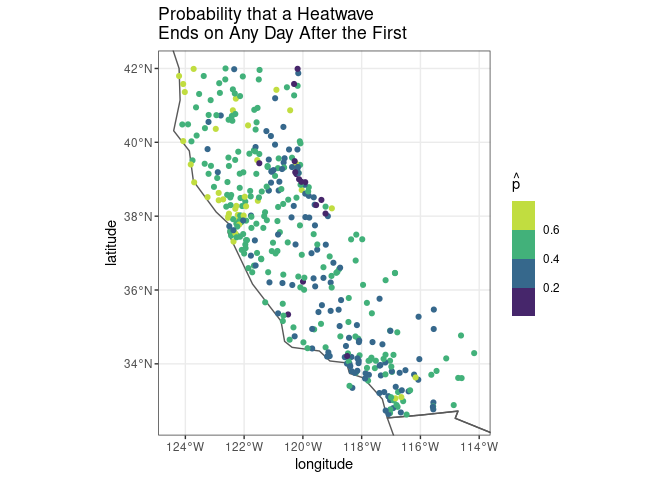
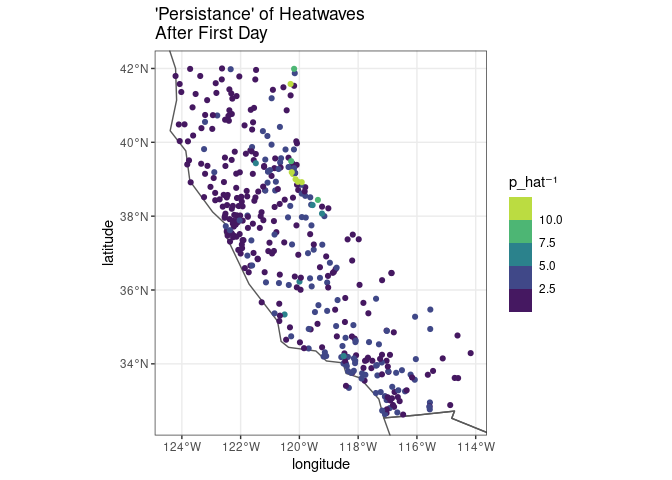
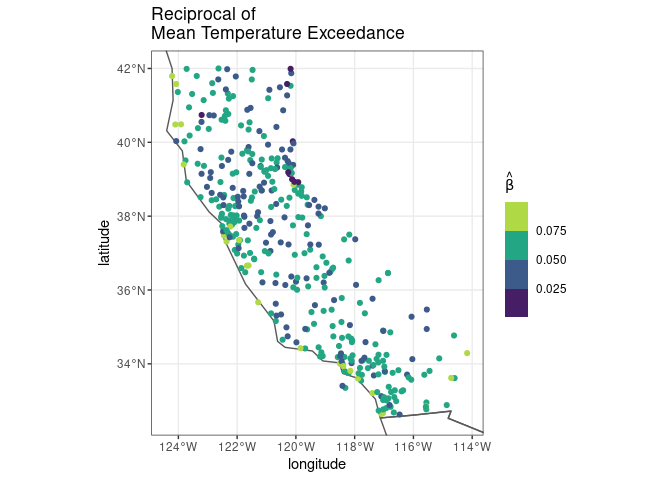
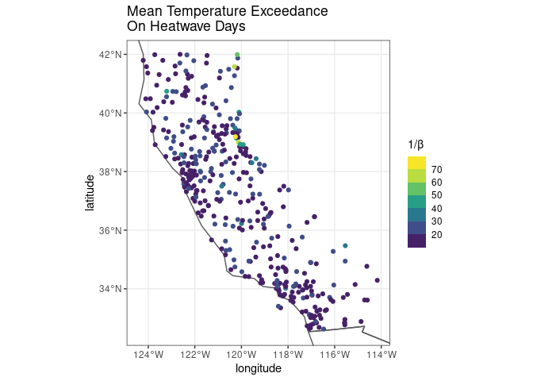

A First Look of GTETLG Applied to Minimum Temperature
================
alexander
2022-10-06

``` r
# Load packages -----------------------------------------------------------
library(tidyverse)
library(lubridate)
library(rnaturalearth)
library(rnaturalearthdata)

source("./gtetlg_utils.R")

# Declare constants -------------------------------------------------------
world <- ne_countries(returnclass = "sf")
ca_bbox <- c(-124.409591, -114.131211,
             32.534156, 42.009518)

# Load data ---------------------------------------------------------------
ghcnd_stations_tmin_95p_hhy_events_df <- read_csv("../data/ghcnd_tmin_95p_hhy_events.csv")
```

    ## Rows: 136908 Columns: 9
    ## ── Column specification ────────────────────────────────────────────────────────────────────
    ## Delimiter: ","
    ## chr  (1): unique_id
    ## dbl  (7): event_var_threshold, total, max_rate, length, event_number, longitude, latitude
    ## date (1): date
    ## 
    ## ℹ Use `spec()` to retrieve the full column specification for this data.
    ## ℹ Specify the column types or set `show_col_types = FALSE` to quiet this message.

``` r
# Estimate parameters -----------------------------------------------------
ghcnd_stations_tmin_95p_hhy_params_df <- ghcnd_stations_tmin_95p_hhy_events_df %>%
  na.omit() %>%
  group_by(unique_id) %>%
  summarize(latitude = min(latitude),
            longitude = min(longitude),
            event_var_threshold = min(event_var_threshold),
            n_events = max(event_number),
            q_hat = q_est(length),
            p_hat = p_est(length),
            b_hat = b_est(length, total)) %>%
  na.omit() %>%
  filter(n_events >= 100)


# Number of events by station ---------------------------------------------
```

``` r
ggplot(data = world) +
  geom_sf(fill = NA) +
  coord_sf(xlim = ca_bbox[1:2],
          ylim = ca_bbox[3:4]) +
  geom_point(data = ghcnd_stations_tmin_95p_hhy_params_df,
             aes(x = longitude, y = latitude, color = n_events)) +
  scale_color_viridis_b(breaks = seq(100,800,by = 100)) +
  labs(title = "Number of Events",
       color = "n") +
  theme_bw()
```

<!-- -->

``` r
# qhat by station ---------------------------------------------------------
```

``` r
ggplot(data = world) +
  geom_sf(fill = NA) +
  coord_sf(xlim = ca_bbox[1:2],
           ylim = ca_bbox[3:4]) +
  geom_point(data = ghcnd_stations_tmin_95p_hhy_params_df,
             aes(x = longitude, y = latitude, color = q_hat)) +
  scale_color_viridis_b() +
  labs(title = "Probability that a Heatwave\nLasts Only One Day",
       color = expression(hat(q))) +
  theme_bw()
```

<!-- -->

``` r
# qhat complement by station ---------------------------------------------------------
```

``` r
ggplot(data = world) +
  geom_sf(fill = NA) +
  coord_sf(xlim = ca_bbox[1:2],
           ylim = ca_bbox[3:4]) +
  geom_point(data = ghcnd_stations_tmin_95p_hhy_params_df,
             aes(x = longitude, y = latitude, color = 1-q_hat)) +
  scale_color_viridis_b() +
  labs(title = "Probability that a Heatwave\nLasts Beyond One Day",
       #color = paste0("1-", expression(hat(q)))
       color = "1-q_hat"
       ) +
  theme_bw()
```

<!-- -->

``` r
# phat by station ---------------------------------------------------------
```

``` r
ggplot(data = world) +
  geom_sf(fill = NA) +
  coord_sf(xlim = ca_bbox[1:2],
           ylim = ca_bbox[3:4]) +
  geom_point(data = ghcnd_stations_tmin_95p_hhy_params_df,
             aes(x = longitude, y = latitude, color = p_hat)) +
  scale_color_viridis_b() +
  labs(title = "Probability that a Heatwave\nEnds on Any Day After the First",
       #color = "p_hat"
       color = expression(hat(p))
       ) +
  theme_bw()
```

<!-- -->

``` r
# Reciprocal of phat by station -------------------------------------------
```

``` r
ggplot(data = world) +
  geom_sf(fill = NA) +
  coord_sf(xlim = ca_bbox[1:2],
           ylim = ca_bbox[3:4]) +
  geom_point(data = ghcnd_stations_tmin_95p_hhy_params_df,
             aes(x = longitude, y = latitude, color = 1/p_hat)) +
  scale_color_viridis_b() +
  labs(title = "\'Persistance\' of Heatwaves\nAfter First Day",
      # color = "1/p_hat",
      color = paste0("p_hat", "\U207B", "\U00B9")) +
  theme_bw()
```

<!-- -->

``` r
# bhat by station ---------------------------------------------------------
```

``` r
ggplot(data = world) +
  geom_sf(fill = NA) +
  coord_sf(xlim = ca_bbox[1:2],
           ylim = ca_bbox[3:4]) +
  geom_point(data = ghcnd_stations_tmin_95p_hhy_params_df,
             aes(x = longitude, y = latitude, color = b_hat)) +
  scale_color_viridis_b() +
  labs(title = "Reciprocal of\nMean Temperature Exceedance",
       # color = "1/p_hat",
       color = expression(hat(beta))) +
  theme_bw()
```

<!-- -->

``` r
# Reciprocal of bhat by station -------------------------------------------
```

``` r
ggplot(data = world) +
  geom_sf(fill = NA) +
  coord_sf(xlim = ca_bbox[1:2],
           ylim = ca_bbox[3:4]) +
  geom_point(data = ghcnd_stations_tmin_95p_hhy_params_df,
             aes(x = longitude, y = latitude, color = 1/b_hat)) +
  scale_color_viridis_b() +
  labs(title = "Mean Temperature Exceedance\nOn Heatwave Days",
       # color = "1/p_hat",
       color = "1/\U03B2") +
  theme_bw()
```

<!-- -->
